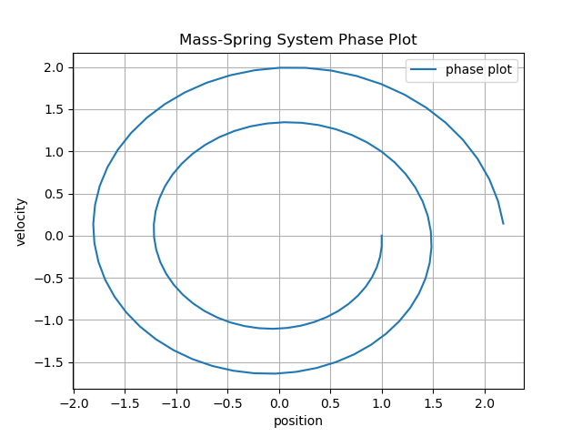
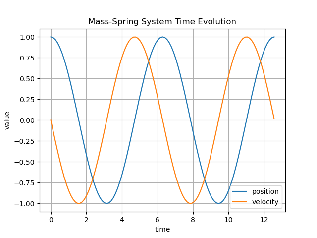
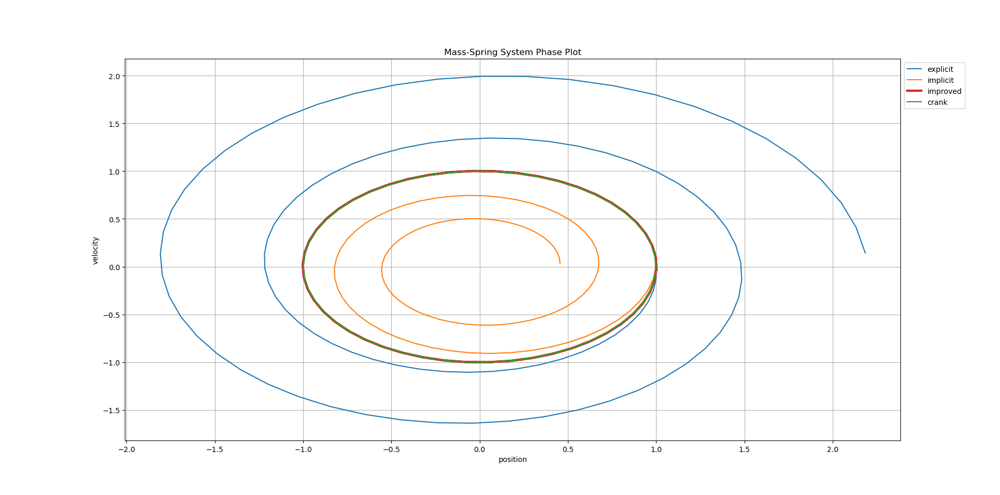
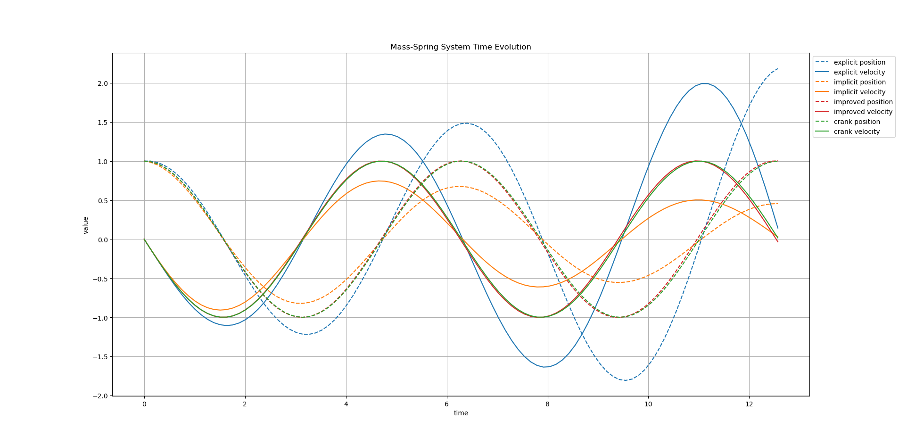
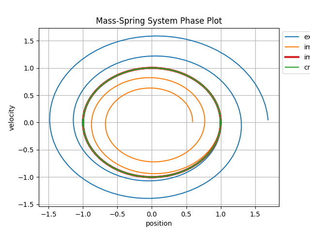
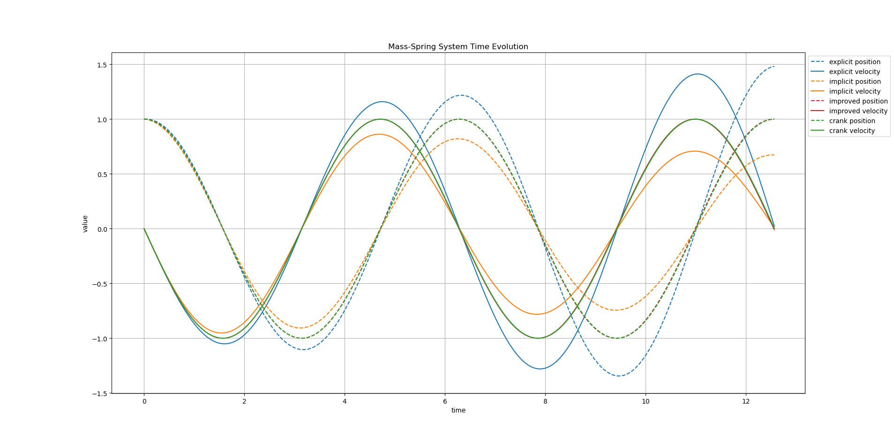

# Mass Spring System

This example demonstrates the application of the ASC-ODE package to simulate
a mass-spring system. The mass-spring system is a classic example in physics
and engineering, characterized by oscillatory motion due to the restoring force
of the spring.

## Explicit Euler

Below is a phase plot for a mass-spring system solved using the Explicit Euler method.

Here we can see that the Explicit Euler method does not conserve energy,
leading to a spiraling outwards trajectory in the phase plot.

## Implicit Euler

Below is a phase plot for a mass-spring system solved using the Implicit Euler method.

Here we observe that the Implicit Euler method also fails to conserve energy, 
resulting in a spiraling inwards trajectory in the phase plot.

## Improved Euler

Below is a phase plot for a mass-spring system solved using the Improved Euler method.

First the system phase plot and time evolution using the Improved Euler method with step size h=0.1:

Here we can see that the Improved Euler method provides a better approximation of the system's dynamics,
with a more circular trajectory in the phase plot, indicating improved energy conservation compared to the Explicit and Implicit Euler methods.

## Crank-Nicolson

Below is a phase plot for a mass-spring system solved using the Crank-Nicolson method.  

First the system phase plot and time evolution using the Improved Euler method with step size h=0.1:

Here we can see that the Crank-Nicolson method provides a very good approximation of the system's dynamics,
with a nearly circular trajectory in the phase plot, indicating excellent energy conservation.

## Runge-Kutta

### Explicit Runge Kutta Method

Below is a phase plot for a mass-spring system solved using both Explicit and Implicit Runge Kutta methods with the different helper functions to generate Butcher tableaus.

First the system phase plot and time evolution using the Explicit Runge Kutta method with step size h=0.1:

### Implicit Runge Kutta Method

Next the system phase plot and time evolution using the Implicit Runge Kutta method with step size h=0.1:

#### Implicit Runge Kutta Method with Gauss-Legendre Butcher Tableau

Next the system phase plot and time evolution using the Implicit Runge Kutta method with Gauss-Legendre Butcher Tableau and step size h=0.1:

## Comparison of different methods and step sizes

### Step Size T = 100

### Step Size T = 150

### Step Size T = 200

